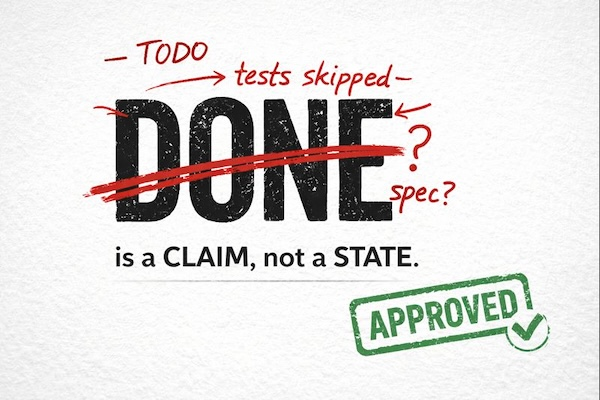

# Agent-Streams: Skeptical Overseer Long-Running AI Agent Workflow



Long-running coding agents are fantastic. I love giving them a big task, letting them run overnight, and coming back to merged code the next day.

The problem is that they often declare victory too early, miss requirements, or just make mistakes. A few days ago I asked Claude to build a tool to process a bunch of images using Moondream3. I let it run overnight. In the morning Claude said it was “done”—except the Moondream3 integration was a `# TODO`, and the tests were disabled. That’s when I realized I needed a better setup. `DONE` isn’t a state; it’s a claim that has to survive skeptical review.

Agents optimize for “done,” not correctness. That’s why you wake up to `TODO` stubs and disabled tests. I’ve tried techniques like detailed TODO lists and lots of tooling, but I don’t want to micromanage low-level process details. I want to give the agent a high-level spec and come back to mergeable code.

This is code review for agents: one role builds; another verifies.

So I split the workflow into two roles: a builder and an overseer. Rather than fight the builder’s tendency to declare victory early, I lean into it. Let it sprint to “done.” Then make that claim survive a skeptical review.

The overseer isn’t magically smarter; it’s independent. Fresh context means it doesn’t inherit the builder’s narrative, shortcuts, or “this should be fine” reasoning. Its job is simple: read the spec, review the diff, and try to find what’s missing.

In practice the overseer is another Claude session with a different instruction set. But it has one hard rule: it does not edit code. It only returns a verdict by writing `ISSUES.md` or `APPROVED`. If it can’t justify approval from the spec + diff (and whatever checks it runs), it files issues and hands the baton back to the builder.

Here’s what a tiny `ISSUES.md` excerpt looks like when the overseer finds a real regression:

```markdown
## Critical: Regression
- Builder claims the failures are “pre-existing” — false.
- Evidence: `git checkout <base_sha> && uv run pytest cli/test_game_loop.py` passes; after this stream, 10 fail.
- Fix required: remove or replace the production-rate heuristic in `strategic.py`.
```

```text
Spec → Builder → DONE → Skeptical Overseer → APPROVED | ISSUES.md → Fix loop → Merge
```

Here’s what I do now:

1. I start by chatting with Claude to sketch the shape of the solution, then break the work into workstreams.
2. For each workstream, I have the builder write a spec, ask questions, clear up ambiguities, and make sure we agree on what “done” looks like.
3. In a second separation-of-duties step, I review that spec with fresh context (a new Claude instance) to prevent drift and agreement bias. This also catches missing requirements long before code review.
4. I launch an agent-stream: it runs in its own tmux session and git worktree.
5. The builder works until it thinks it’s done, then creates a `DONE` marker file.
6. Once `DONE` exists, the skeptical overseer reviews the work and either creates an `APPROVED` marker file (meaning merge) or writes an `ISSUES.md` file (meaning keep iterating). The default review prompt assumes issues will be found.
7. The loop repeats until `APPROVED` is created, at which point the work is merged back to the original branch and the next workstream is automatically launched.

The spec is the leverage point for the whole process. It tells the builder what to build, and it tells the overseer what to verify. The spec is the trust boundary.

This lets me run autonomous, multi-hour coding sessions overnight and come back the next day with merged code and a high degree of confidence that it’s complete and correct.

I’ve built a simple tool called Agent-Streams that implements this “skeptical overseer” pattern. It’s a local orchestration framework for autonomous agent workflows that implements a “spec → build → review → fix → merge” loop. It uses tmux, git worktrees, Prometheus metrics, and streams output for visibility. It’s very simple by design.

[github.com/john-b-rush/agent-streams](https://github.com/john-b-rush/agent-streams)

I think you should build your own version of this, and I also think you probably shouldn’t use mine. The valuable thing isn’t tmux or worktrees or metrics or my directory layout. The valuable thing is the trust boundary: a spec that the builder uses to build, and the overseer verifies against. Agent-Streams is just one way I enabled that boundary in my workflow, and I fully expect the exact tooling to be obsolete once Claude and Codex ship this natively.

Steal the trust boundary: builder ships; overseer verifies; `DONE` must survive review.
