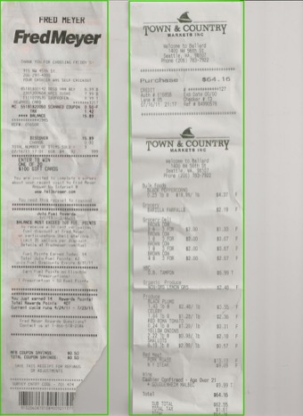

# 25 Years of Eggs

*Published: February 19, 2026*

Everyone needs a rewarding hobby. I've been scanning all of my receipts since 2001. I never typed in a single price — just kept the images. I figured someday the technology to read them would catch up, and the data would be interesting.

This year I tested it. Two AI coding agents, 11,345 receipts. I started with eggs. If you can track one item across 25 years of garbled thermal prints, OCR failures, and folder typos, you can track anything.

14 days. ~$1,600 in token costs. 589 egg receipts found. Here's what the data says.

$0.58/dozen at WinCo in 2002 — rural Idaho pricing. $5.82/dozen average in 2025. Try "Inflation-Adjusted" — eggs were actually getting *cheaper* in real terms until the 2022 avian flu spike.

---

Here's what I typed on Day 1:

> Ok so let's make a project plan. In the ~/Records/ we have a ton of receipts. Many are pdf/image/etc. I want to go through and extract the actual content of the receipts to find how much we spend on eggs. Receipts are notoriously terrible to OCR, so we might need to do something more advanced.

That was the entire spec. Codex explored my file system, found two existing SQLite databases I'd forgotten about, discovered 11,345 receipts across PDFs, emails, and images, and came back with a project plan. I said "write this out to a plan.md please." It did. We were building within the hour.

The whole thing took 14 days. Maybe 14-18 hours of me actually at the keyboard — short bursts of direction-giving separated by long stretches of the agents just running. Codex ran 15 interactive sessions. Claude handled 10. Between them, they spawned 16,762 automated tasks.

### Shades of White

The oldest receipts were flatbed scans — multiple receipts per page, random orientations, white paper on a white scanner bed. Codex and I tried seven classical CV approaches to find receipt boundaries. Edge detection. Adaptive thresholding. Contour analysis. Morphological operations. Watershed segmentation. Template matching. A grid-based decomposition I pitched as "a classic HackerRank problem."

None of them worked. The core issue: receipts are white and so is the scanner bed. I started calling it the "shades of white" problem. The cleverest attempt was inspired by removing tourists from landmark photos — stack all scans, compute the median pixel at each position, subtract to reveal edges. I thought that one was going to work. Best F1: 0.302.

We also threw macOS Vision OCR at it (via a Swift script Codex wrote on the fly), Tesseract, several other tools. I was starting to think the flatbed scans might just be a loss. Then I tried Meta's SAM3.

One API call with `text="receipt"`. 0.92-0.98 confidence on every boundary. Four seconds per scan. 1,873 receipts from 760 multi-receipt pages. Seven approaches in hours; SAM3 in an afternoon.

### Wait — You Already Know the Answer

Receipts land at random angles, and OCR needs them upright. We tried Tesseract's orientation detection, macOS Vision OCR, Moondream 2 and 3 — each one better than the last but none reliable enough. Then I realized that every time I pasted a receipt into our Claude conversation to debug something, it was already reading the text perfectly. Rotated, faded, didn't matter.

Why am I building a rotation pipeline when the tool I'm talking to already solves this? So we sent all 11,345 receipts through Sonnet and Codex. Sometimes the answer is embarrassingly obvious once you stop engineering around it.

### Replacing Tesseract Overnight

Halfway through the project, Tesseract was the weak link. It read "OAT MILK" as "OATH ILK." It dropped decimals — `$4.37` became `$437`. On old thermal prints it produced nothing at all. Codex opened 20 of the worst ones by hand and found that some weren't even receipts. A family photo. A postcard. A greeting card. All filed under "Receipts."

I found PaddleOCR-VL — a 0.9B parameter vision-language model that runs locally on Apple Silicon. First test on a bank reconciliation: clean, accurate text in 2.1 seconds. Tesseract was faster but dramatically noisier. Second test on a tall Fred Meyer receipt: disaster. The model entered a repetition loop, hallucinating "TILL YGRT" endlessly. That's the weakness of small autoregressive models on long repetitive content.

The fix turned out to be simple — split tall receipts into slices. Dynamic slicing based on aspect ratio: `num_slices = max(2, round(aspect_ratio / 1.5))`. Five parallel shards ran overnight. GPU pegged at 100% for 10.8 hours. In the morning: 11,345 receipts OCR'd successfully. Cleaner text for every receipt in the archive.

PaddleOCR-VL isn't a Codex replacement — it can't do structured extraction or follow instructions. It's a better Tesseract. The real pipeline: `receipt image → PaddleOCR-VL (local, clean text) → Codex/Claude (structured extraction)`.

### Twelve Hours to Three

Once receipts were segmented, oriented, and OCR'd, they needed structured extraction — find the egg line items, pull prices and quantities.

It started with regex. The models love regex. Keyword matching for "egg," money patterns for prices. Heuristics found eggs in 25/25 positive samples with 0 false positives. Not bad. But on the full corpus, false negatives piled up — Fred Meyer abbreviated codes like `STO LRG BRUNN`, Whole Foods truncated to `EDGS`, OCR mangled "EGGS" into `LG EGO 12 CT`. No regex catches these.

So I told Codex "we have unlimited tokens, let's use them all," and we pivoted to sending every receipt through Codex for structured extraction. From that one sentence, Codex came back with a parallel worker architecture — sharding, health management, checkpointing, retry logic. The whole thing. When I ran out of tokens on Codex mid-run, it auto-switched to Claude and kept going. I didn't ask it to do that. I didn't know it had happened until I read the logs.

But the runs kept crashing. Long CLI jobs died when sessions timed out. The script committed results at end-of-run, so early deaths lost everything. I watched it happen three times. On the fourth attempt I said "I would have expected we start a new process per batch." That was the fix — one fresh process per batch, hard call cap, exit cleanly, resume from cache. Codex patched it, launched it in a tmux session, and the ETA dropped from 12 hours to 3. Not a hard fix. Just the kind of thing you know after you've watched enough overnight jobs die at 3 AM.

11,345 receipts processed. The system that was projected to take all night finished before I went to bed.

### The Classifier That Beat Its Own Ground Truth

First I needed ground truth. I asked Claude to build me a labeling tool — keyboard-first, receipt image on the left, classification data on the right, arrow keys to navigate, single keypress to verdict. It built the whole Flask app in 22 minutes. I sat down and hand-labeled 375 receipts.

Regex found 650 receipts mentioning "egg." Against those 375 labels: 88% recall. The misses told the story — abbreviated codes, OCR garble, truncated descriptions. No keyword search catches `STO LRG BRUNN`.

The fix: use those hand-labeled edge cases as few-shot examples in an LLM classifier. Twenty examples of what "eggs" looks like on a garbled thermal print from 2003. Batch 10 receipts per call. Eight parallel workers. Two hours. 11,345 receipts classified.

Final accuracy: 99%+. And here's the thing — every supposed "miss" by the LLM turned out to be a mislabel in the ground truth. A bicycle shop receipt the old heuristic had flagged. A barcode-only scan. Egg noodles. The classifier was more correct than my labels.

Then more QA. A second tool for eyeballing 497 weak images: Space for no-eggs, X for has-eggs. A third for data entry on 95 receipts with missing fields — numpad-optimized, auto-advancing. Four tools total, each built in minutes, each one I ground through by hand.

### Quality

So how good is the data? I pulled 372 random samples and checked them by hand. Overall: 96% correct. The errors were mostly garbled OCR on old scans. One was a hallucination — the pipeline fabricated egg data for a receipt that contained no eggs at all.

Real-world data is relentlessly messy:

- Receipt folder typos spanning years: "Reciepts" (2016-2017) and "Recipts"
- A receipt scanned backwards — Claude decoded the mirrored OCR character by character
- Email receipts silently preferring `text/plain` over `text/html`, dropping pricing lines that only existed in the HTML part
- 164,593 rate limit hits from the automated pipeline grinding against the API

That last number isn't a typo. The pipeline was resilient enough to just keep retrying.

But here's what made the quality good: every time I caught something, I could show the agents what to look for and they'd go fix it everywhere. I caught a store address hiding in OCR noise: "915 Ny 45th St" was 915 NW 45th St, Seattle. I showed them the pattern, they ran a recovery pass on 40 missing-location receipts — all 40 resolved.

### The Ledger

| | |
|--------|-------|
| **Wall clock time** | 14 days (Feb 8-22, 2026) |
| **Hands-on time** | ~14-18 hours |
| **Automated tasks** | 16,762 |
| **Tokens consumed** | ~1.6 billion (166M non-cache) |
| **Estimated token cost** | ~$1,591 |
| **Confirmed egg receipts** | 589 |
| **Total egg spend captured** | ~$1,972 |
| **Total eggs** | 8,604 |

Codex and Claude are extraordinary at building tools and extracting structured data, but they couldn't segment an image or replace an OCR engine. The right answer was a stack of specialized models — SAM3 for segmentation, PaddleOCR for text, Codex and Claude for everything else. I expected this, but it was worth trying the simple path first.

These are the days of miracle and wonder. I can't wait to see what 30 years of eggs looks like.

<link rel="stylesheet" href="../assets/eggs/eggs-styles.css">

