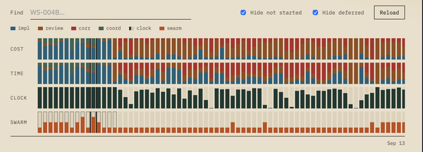
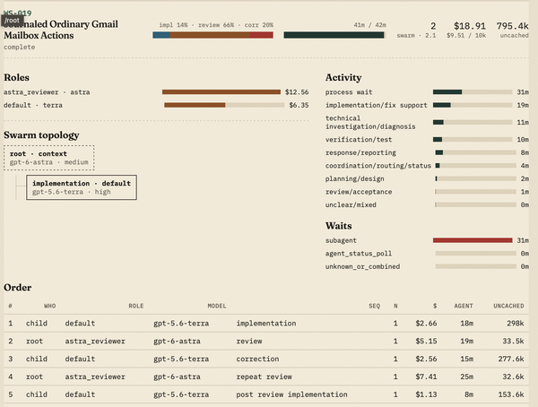
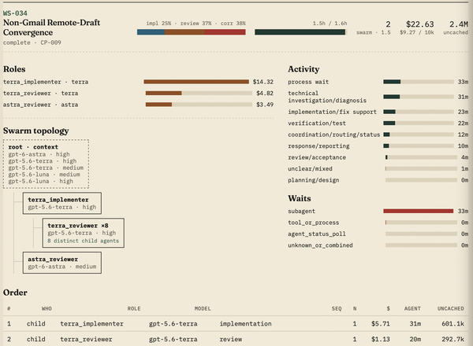
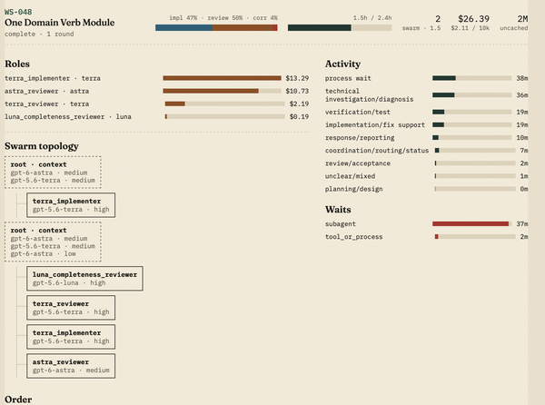

# Finding the Bottlenecks in Agentic Development

*Published: September 17, 2026*

I'm building a new AI email client. I wanted to improve my agentic development process, so I started instrumenting it and looking for bottlenecks.

The goal wasn't to produce a perfect benchmark or a universal formula for building software with agents. I wanted enough visibility to make better decisions about where to spend tokens, when to parallelize work, and which models should handle which jobs.

## Start with Progress

First, I used programmatically verifiable benchmarks to define progress. There is a benchmark for opening emails, another for viewing attachments, another for getting new mail, and others for things like loading speed and software performance.

I grouped those benchmarks into checkpoints: vertical slices of capability that I could build and validate as I went. Each checkpoint contained several workstreams. For the "read emails" checkpoint, for example, one workstream handled opening rich-text email while another handled attachments.

This gave the agents a nicely bounded scope to build against. It also exposed an interesting dependency: the right size for a workstream depended on the model executing it. Smaller models like `luna` did better with smaller workstreams, while `astra` handled larger ones well.

## Measure What Matters

To understand the impact of different approaches, I needed process metrics. Quality metrics are important, but they belong elsewhere. These metrics are about how the work gets done.

The first metric is cost. I used API cost per 10,000 changed, committed tokens—`$/10kCoT`—to normalize across workstreams and checkpoints with different scopes. Like lines of code, 10kCoT has obvious flaws, but it was good enough for this use. Even though I'm on a subscription, using API pricing gave me a consistent way to compare models. Empirically, it also aligned well with how my weekly limits were being used.

The next metric is generated versus committed tokens. This approximates how much model output it took to produce the code that was ultimately committed. We don't expect every output token to become code: there are reasoning tokens, coordination between agents, reviews, status reports, and some amount of rework or mistakes. A lower ratio is not automatically better.

The important thing is to balance generated tokens against `$/10kCoT`. `luna` is so cheap that even generating ten times as many tokens costs only about 20% as much as `astra`. It isn't as simple as minimizing generated tokens. That strategy can lead you in the wrong direction.

The final metric is active time versus wall-clock time. Active time measures how much wall-clock time agents are actually working. This helps identify where I might be holding things up and where parallelism could help.

There are tradeoffs here too. In my runs, the smaller models generally required more rework and review cycles. That cost time, but I traded the time for lower cost. Sometimes it is better to spend tokens to get speed—especially when Tibo says there is a reset coming at the end of the day.

These metrics let me make thoughtful tradeoffs instead of guessing at where the bottleneck is.

## How It Went

The main resource constraint I'm facing is that I'm token-poor. I have a single Pro account, so I want to get as much productive use out of it as possible.

On the early checkpoints, `astra` handled implementation, and it was expensive. CP-17 cost $23.59 per 10kCoT. I moved to `terra` as the implementer and kept `astra` as the reviewer. That lowered CP-7's cost to $15.60 per 10kCoT—a significant improvement—but the review was still expensive. In WS-19's case, the review cost twice as much as the implementation itself.

That suggested a new model: have `terra` perform a first review-and-fix pass, followed by a final review with `astra`. This reduced WS-34's cost to $9.27 per 10kCoT. Even with multiple `terra` reviews, `terra` accounted for only 58% of the total review cost, while `astra` accounted for 42%.

In a couple of cases, though, the `terra` and `luna` implementers did not complete all of the required benchmarks. I was spending expensive review tokens on incomplete work.

So I added a simple completeness-check step with `luna`. That step looked only for benchmark completeness; it did not evaluate correctness. This drove the cost of the next workstream down to $2.11 per 10kCoT, with the completeness review costing only $0.19.

Cheap checks that save expensive work are a classic system-design trick.

I was still seeing my weekly limit get consumed fairly quickly, so I looked at what was still costing a lot. In this case, it was the `astra` coordinator spending expensive tokens acting as a heartbeat. CP-7's `astra` coordination cost $1.86 per 10kCoT, while CP-9's `terra` coordinator cost about $0.15 per 10kCoT—even though it handled about three times as much coordination.

## The Next Bottleneck

The best optimization is not to do the work in the first place. So I dug into why there was so much coordination.

Some architectural assumptions required the work to be serialized. A rearchitecture that removed those assumptions and built stronger, more independent components would allow more concurrency without increasing coordination proportionally.

Independent components would let me explore more complex agent-swarm topologies, apply more compute to the problem, and—most importantly—measure whether those approaches actually help or merely burn dollars.
